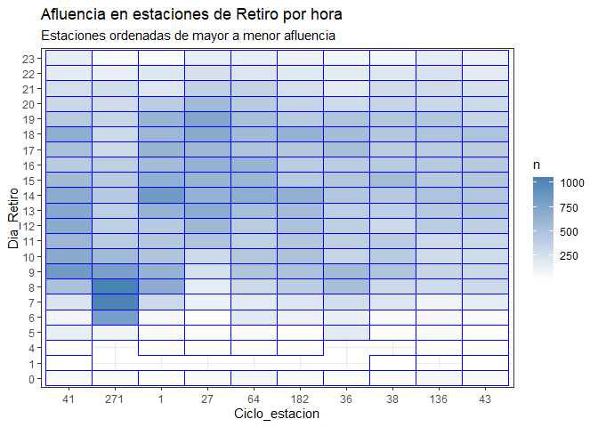
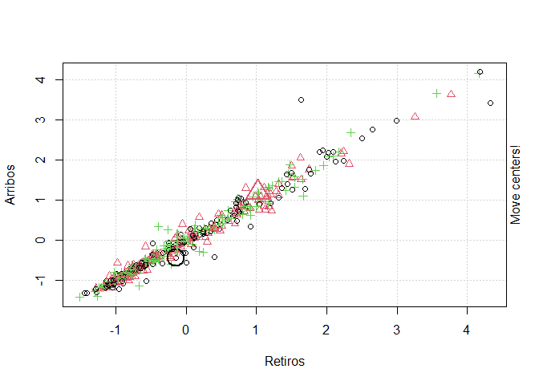
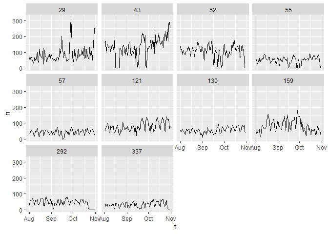

Ejercicios de Ecobici
================

En esta notebook se llevan acabo los 3 incisos del primer ejercicio

``` r
library(readr)

library(dplyr)
library(lubridate) #Fechas y horas
library(tidyr) #spread 
#graficas
library(ggplot2)
library(gridExtra)

library(tseries)

#cluster
library(animation)
library(factoextra)

#test
library(funtimes)
```

**Funciones**

``` r
#Prueba para tendencia en series de tiempo.

test_tend_lin<-function(dataset){
  p_values<-NULL
  ar_order<-NULL
  ar_coef<-NULL
  for(i in 1:ncol(dataset)){
    #print(i)
    dat_ts<-ts(dataset[,i]) #seleccionar serie
    aux<-notrend_test(dat_ts) #Prueba tendencia
    p_values<-c(p_values,aux$p.value) #Obtener valor p 
    ar_order<-c(ar_order,aux[["estimate"]][["AR_order"]]) #Obtener AR_order
    ar_coef<-c(ar_coef,mean(aux[["estimate"]][["AR_coefficients"]])) #Obtener phi
  }
  final_v<-list(p_values,ar_order,ar_coef) #lista con todos los valores obtenidos 
  final_v<- as.data.frame(final_v) #convertir a df
  names(final_v)<-c("p_values","AR_order","AR_coef")
  final_v$Estacion<- colnames(dataset) # Agregar n??mero de estaci??n
  return(final_v)
}
```

### Obtener datos

``` r
dataset <- read_csv("csv_files/dataset.csv")

#cambiar nome de columna, fecha Arribo por facilidad de manejo
names(dataset)[names(dataset) == 'Fecha Arribo'] <-'Fecha_Arribo'
```

# 1.1 ??En qu?? horarios hay mayor afluencia y en qu?? estaciones?

### Afluencia en retiros(horarios).

``` r
#Crear variable de hora de retiro como factor y variable de dia de la semana
dataset$Hora_Retiro_fac <- as.factor(hour(dataset$Hora_Retiro))
dataset$Dia_Retiro <- as.factor(wday(dataset$Fecha_Retiro, label = TRUE)) 

#Conteo de retiros por d??a, hora
e1<-dataset %>% dplyr::count(Hora_Retiro_fac,Dia_Retiro)
head(e1 %>% arrange(desc(n)),5)
```

    ## # A tibble: 5 x 3
    ##   Hora_Retiro_fac Dia_Retiro     n
    ##   <fct>           <ord>      <int>
    ## 1 18              Wed        16730
    ## 2 18              Mon        15707
    ## 3 18              Thu        15243
    ## 4 18              Tue        14847
    ## 5 8               Tue        14374

``` r
#Conteo de retiros por horas 
e2<- dataset %>% dplyr::count(Hora=Hora_Retiro_fac, sort = TRUE)
head(e2,5)
```

    ## # A tibble: 5 x 2
    ##   Hora      n
    ##   <fct> <int>
    ## 1 18    88774
    ## 2 14    88719
    ## 3 15    83285
    ## 4 13    79166
    ## 5 17    75785

``` r
e2$variable<-"retiros"
```

### Afluencia en arribos(horarios).

``` r
#Crear variable de hora de arribo como factor y variable de dia de la semana

dataset$HoraArribo_fac <- as.factor(hour(dataset$Hora_Arribo))
dataset$DiaArribo <- as.factor(wday(dataset$Fecha_Arribo, label = TRUE)) 

#Conteo de arribos por d??a, hora
d1<-dataset %>% dplyr::count(HoraArribo_fac,DiaArribo)
head(d1 %>% arrange(desc(n)),5)
```

    ## # A tibble: 5 x 3
    ##   HoraArribo_fac DiaArribo     n
    ##   <fct>          <ord>     <int>
    ## 1 18             Wed       16031
    ## 2 18             Mon       14835
    ## 3 18             Thu       14769
    ## 4 19             Wed       14656
    ## 5 15             Fri       14302

``` r
#Conteo de retiros por horas
d2<- dataset %>% dplyr::count(Hora=HoraArribo_fac, sort = TRUE)
head(d2,5)
```

    ## # A tibble: 5 x 2
    ##   Hora      n
    ##   <fct> <int>
    ## 1 14    88665
    ## 2 18    86563
    ## 3 15    85583
    ## 4 19    79391
    ## 5 13    77394

``` r
d2$variable<-"arribo"
```

## Gr??ficas de afluencia por horarios

``` r
#Unir datos de afluencia
horas<-rbind(d2,e2)

#Gr??fica de afluencia por horas
g4<-ggplot(horas, aes(x=as.factor(Hora), y=n, fill=variable)) +geom_bar(stat='identity', position='dodge')+theme_bw()+ggtitle(("Afluencia por hora para retiros/arribos"))

#Gr??fica de afluecia de Retiros por d??a/Hora
f1<-ggplot(e1,aes(x=Hora_Retiro_fac, y=n, color=Dia_Retiro))+ geom_point(aes(group= Dia_Retiro)) +geom_line(aes(group= Dia_Retiro))+ggtitle("Retiros por Dia/Hora")+xlab("Hora de Retiro")+ylab("Recuento")+scale_colour_hue(labels=c('Domingo','Lunes','Martes','Miercoles','Jueves','Viernes','Sabado'))+theme_bw()

#Gr??fica de afluecia de Arribos por d??a/Hora
g1<-ggplot(d1,aes(x=HoraArribo_fac, y=n, color=DiaArribo))+ geom_point(aes(group= DiaArribo)) +geom_line(aes(group= DiaArribo))+ggtitle("Arribos por Dia/Hora")+xlab("Hora de Arribo")+ylab("Recuento")+scale_colour_hue(labels=c('Domingo','Lunes','Martes','Miercoles','Jueves','Viernes','Sabado'))+theme_bw()
```

``` r
g4
```

<!-- -->

De la gr??fica podemos notar que las horas pico de Retiro son a las
18:00,14:00,15:00 y 13:00 horas mientras que para arribos son las
14:00,18:00,15:00 y 19:00 horas. Las horas pico parecen ser horarios de
comida o salida de trabajo.

``` r
grid.arrange(f1,g1)
```

<!-- --> Los d??as de
lunes a Viernes tienen un comportamiento similar, mientras que para
sabado y domingo, las horas pico de retiro son entre 12:00, 14:00 hrs
mientras que para arribo son a las 13:00, 14:00 hrs

## ??En qu?? estaciones hay mayor afluencia de Retiros?

### Afluencia en estaciones para retiros

``` r
#Contar usuarios en estaci??n retiro
Retiro_count<-dplyr::count(dataset, Ciclo_Estacion_Retiro, sort = TRUE)

#seleccionamos las 10 estaciones con m??s Retiros
Retiro_count<-head(Retiro_count,10)$Ciclo_Estacion_Retiro

#Obtener datos de esas estaciones
Retiro_popular<-dataset %>% filter(Ciclo_Estacion_Retiro %in% Retiro_count)

#Conteos por grupos
Retiro_popular<-Retiro_popular %>% count(Ciclo_Estacion_Retiro,Hora_Retiro_fac)

#Convertir valor a factor, ordenar por estaciones con mayor afluencia
Retiro_popular$Ciclo_Estacion_Retiro<-factor(Retiro_popular$Ciclo_Estacion_Retiro, levels =Retiro_count)

#Graficar
f3<-ggplot(Retiro_popular, aes( as.factor(Ciclo_Estacion_Retiro),Hora_Retiro_fac)) +
  geom_tile(aes(fill = n), color = "blue") +
  scale_fill_gradient(low = "white", high = "steelblue") +
  ylab("Dia_Retiro") +
  xlab("Ciclo_estacion") +
  theme_bw() +
  labs(fill = "n") +ggtitle("Afluencia en estaciones de Retiro por hora",subtitle = "Estaciones ordenadas de mayor a menor afluencia")
```

### Afluencia en estaciones para arribos

``` r
#Contar usuarios en estaci??n arribo
Arribo_count<-dplyr::count(dataset, Ciclo_EstacionArribo, sort = TRUE)

#seleccionamos las 10 estaciones con m??s arribos
Arribo_count<-head(Arribo_count,10)$Ciclo_EstacionArribo

#Obtener datos de esas estaciones
Arribo_popular<-dataset %>% filter(Ciclo_EstacionArribo %in% Arribo_count)

#Conteos por grupos
Arribo_popular<-Arribo_popular %>% count(Ciclo_EstacionArribo,HoraArribo_fac)

#Convertir valor a factor, ordenar por estaciones con mayor afluencia
Arribo_popular$Ciclo_EstacionArribo<-factor(Arribo_popular$Ciclo_EstacionArribo, levels =Arribo_count)

#Graficar
g3<-ggplot(Arribo_popular, aes( as.factor(Ciclo_EstacionArribo),HoraArribo_fac)) +
  geom_tile(aes(fill = n), color = "blue") +
  scale_fill_gradient(low = "white", high = "steelblue") +
  ylab("DiaArribo") +
  xlab("Ciclo_estacion") +
  theme_bw() +
  labs(fill = "n") +ggtitle("Afluencia en estaciones de arribo por hora",subtitle = "Estaciones ordenadas de mayor a menor afluencia")
```

## ??En qu?? horarios hay mayor afluencia y en qu?? estaciones?

``` r
f3
```

<!-- -->

``` r
g3
```

<!-- -->

Se nota una mayor afluencia de arribo por las tardes, recordando la
gr??fica de retiros, la estaci??n 271 en particular tiene muchos retiros
por las ma??anas y arribos por las tardes. La mayor??a de estaciones
consideradas son populares tanto en retiros como en arribos.

# 1.2. Perfiles de uso de las estaciones.

**Empezaremos por un an??lisis exploratorio**

``` r
#Verificar las estaciones que tenemos
dataset%>% 
    distinct(Ciclo_Estacion_Retiro) %>% 
    count()
```

    ## # A tibble: 1 x 1
    ##       n
    ##   <int>
    ## 1   475

``` r
dataset%>% 
    distinct(Ciclo_EstacionArribo) %>% 
    count()
```

    ## # A tibble: 1 x 1
    ##       n
    ##   <int>
    ## 1   475

``` r
# De dond?? retiran las bicis y a dond?? llegan
bike_use_path <- dataset%>% 
    group_by(Ciclo_Estacion_Retiro, Ciclo_EstacionArribo) %>% 
    count() %>% 
    ungroup()

#De que estaciones retiran m??s bicis
bike_use_retiro <- dataset%>% 
    group_by(Ciclo_Estacion_Retiro) %>% 
    count() %>% 
    ungroup() %>% 
    arrange(-n)


#A qu?? estaciones arriban m??s bicis
bike_use_arribo <- dataset%>% 
    group_by(Ciclo_EstacionArribo) %>% 
    count() %>% 
    ungroup() %>% 
    arrange(-n)
```

### Estaciones m??s y menos concurridas retiros

``` r
bu2 <- bike_use_retiro %>% 
    top_n(30) %>% 
    ggplot() +
    geom_col(mapping = aes(y=as.factor(Ciclo_Estacion_Retiro) %>% 
                               reorder(n),
                           x=n),
             fill = 'steelblue',
             alpha = 0.8,
             color = 'black') +
    xlab('N??mero de entradas de bicicletas') +
    ylab('id de estaci??n') + 
    ggtitle('Top estaciones concurridas (retiro)')
```

    ## Selecting by n

``` r
cu2 <- bike_use_retiro %>% 
    top_n(-30) %>% 
    ggplot() +
    geom_col(mapping = aes(y=as.factor(Ciclo_Estacion_Retiro) %>% 
                               reorder(-n),
                           x=n),
             fill = 'steelblue',
             alpha = 0.8,
             color = 'black') +
    xlab('N??mero de entradas de bicicletas') +
    ylab('id de estaci??n') +
    ggtitle('Estaciones menos concurridas (retiro)')
```

    ## Selecting by n

``` r
grid.arrange(bu2, cu2, ncol = 2)
```

<!-- -->

### Estaciones m??s y menos concurridas arribos

``` r
#M??s concurridas
bu1<-bike_use_arribo %>% 
    top_n(30) %>% 
    ggplot() +
    geom_col(mapping = aes(y=as.factor(Ciclo_EstacionArribo) %>% 
                               reorder(n),
                           x=n),
             fill = 'steelblue',
             alpha = 0.8,
             color = 'black') +
    xlab('N??mero de entradas de bicicletas') +
    ylab('id de estaci??n') + 
    ggtitle('Top estaciones concurridas (arribo)')+ theme_bw()
```

    ## Selecting by n

``` r
#Menos concurridas
cu1<-bike_use_arribo %>% 
    top_n(-30) %>% 
    ggplot() +
    geom_col(mapping = aes(y=as.factor(Ciclo_EstacionArribo) %>% 
                               reorder(-n),
                           x=n),
             fill = 'steelblue',
             alpha = 0.8,
             color = 'black') +
    xlab('N??mero de entradas de bicicletas') +
    ylab('id de estaci??n') +
    ggtitle('Estaciones menos concurridas (arribo)')+ theme_bw()
```

    ## Selecting by n

``` r
grid.arrange(bu1, cu1, ncol = 2)
```

<!-- -->

``` r
#agregar variables de hora decimal
bike_tfm <-dataset %>% 
    mutate(hora_arribo_decimal = hms(Hora_Arribo) %>% as.numeric() %>% round(0) / 3600,
           hora_arribo_decimal = hora_arribo_decimal %>% round(0),
           hora_retiro_decimal = hms(Hora_Retiro) %>% as.numeric() %>% round(0) / 3600,
           hora_retiro_decimal = hora_retiro_decimal %>% round(0))

bike_tfm$Genero_Usuario[is.na(bike_tfm$Genero_Usuario)] = 'NA_genero'
```

``` r
#Separar arribos de retiros
bike_tfm_arribo <- bike_tfm %>% 
    select(Ciclo_EstacionArribo, Genero_Usuario, Edad_Usuario, Fecha_Arribo, DiaArribo, hora_arribo_decimal)

bike_tfm_retiro <- bike_tfm %>% 
    select(Ciclo_Estacion_Retiro, Genero_Usuario, Edad_Usuario, Fecha_Retiro, Dia_Retiro, hora_retiro_decimal)
```

``` r
#               seccion arribos
# calculando cantidad total de arribos por estacion
bike_tfm_arribo_total_arribos <- bike_tfm_arribo %>% 
    group_by(Ciclo_EstacionArribo) %>% 
    summarize(total_arribos = n()) %>% 
    ungroup()

# calculando la hora promedio de arribos por estacion
bike_tfm_arribo_promedio_hora <- bike_tfm_arribo %>% 
    group_by(Ciclo_EstacionArribo) %>% 
    summarize(promedio_hora_arribo = mean(hora_arribo_decimal)) %>% 
    ungroup()

# caclculando la cantidad de arribos efectuado en fin de semana
bike_tfm_arribo_porcentake_weekend <- bike_tfm_arribo %>% 
    mutate(is_weekend = if_else(DiaArribo == 'Sun' |
                                DiaArribo == 'Sat' |
                                DiaArribo == 'Fri',
                                1,
                                0)) %>% 
    group_by(Ciclo_EstacionArribo) %>% 
    summarize(porcentaje_arribos_weekend = sum(is_weekend) / n()) %>% 
    ungroup()

bike_tfm_arribo_porcentake_weekend %>% 
    ggplot() +
    geom_histogram(mapping = aes(x=porcentaje_arribos_weekend),
                   fill = 'forestgreen',
                   color = 'black',
                   alpha = 0.8)+ ggtitle("Distribuci??n de porcentaje de arribos en fin de semana")+theme_bw()
```

    ## `stat_bin()` using `bins = 30`. Pick better value with `binwidth`.

<!-- -->

De la gr??fica anterior resaltar??a el hecho de que hay estaciones para
las que el 50% de sus arribos son en fines de semana

### Preparar data para modelo

``` r
library(plyr)
```

    ## ------------------------------------------------------------------------------

    ## You have loaded plyr after dplyr - this is likely to cause problems.
    ## If you need functions from both plyr and dplyr, please load plyr first, then dplyr:
    ## library(plyr); library(dplyr)

    ## ------------------------------------------------------------------------------

    ## 
    ## Attaching package: 'plyr'

    ## The following objects are masked from 'package:dplyr':
    ## 
    ##     arrange, count, desc, failwith, id, mutate, rename, summarise,
    ##     summarize

``` r
gen<- dataset %>% select("Ciclo_Estacion_Retiro","Genero_Usuario")


# calculando la cantidad de personas en base a genero que interactuan en cada estacion
M<-as.data.frame(table(gen)) %>% filter(Genero_Usuario == "M") 
M<- M %>% select(Ciclo_Estacion_Retiro,Freq)
names(M)<- c("Estaci??n","Genero M")

F<- as.data.frame(table(gen)) %>% filter(Genero_Usuario == "F") 
F<- F %>% select(Ciclo_Estacion_Retiro,Freq)
names(F)<- c("Estaci??n","Genero F")

#calculando la edad promedio de usuarios que interactuan en cada estacion 
ed<- ddply(dataset, .(Ciclo_Estacion_Retiro), summarize,  EdadPromedio=mean(Edad_Usuario))
names(ed)<- c("Estaci??n","Edad Promedio")

#calculando arribos en cada estacion 
Ar<-as.data.frame(table(dataset$Ciclo_EstacionArribo))
names(Ar)<- c("Estaci??n","Arribos")

#calculando retiros en cada estacion 
Re<-as.data.frame(table(dataset$Ciclo_Estacion_Retiro))
names(Re)<- c("Estaci??n","Retiros")


dataf<- Reduce(function(x, y) merge(x, y, all=TRUE), list(Re,Ar,M,F,ed))

#guardar archivo
#dataf %>% write_csv('csv_files/dataset-features-clusters.csv')

#Quitar columna de estaciones
dataf<-dataf[,-1]
dataf
```

    ##     Retiros Arribos Genero M Genero F Edad Promedio
    ## 1      8448    8804     6095     2284      38.32872
    ## 2      4117    3477     3050      874      35.86228
    ## 3      1184    1364      818      323      37.11571
    ## 4      1205    1298      886      277      37.95187
    ## 5      4093    4109     3075     1011      34.52016
    ## 6      1277    1286      905      332      36.01723
    ## 7       881     894      651      196      37.28490
    ## 8      3406    3538     2689      684      37.35261
    ## 9      4207    4206     3242      925      37.65771
    ## 10     1484    1369     1189      263      35.97709
    ## 11     1612    1778     1311      291      37.49380
    ## 12     4061    4219     3114      914      37.82664
    ## 13     2096    2409     1532      533      37.11880
    ## 14     4255    3988     2894     1347      34.80588
    ## 15     2154    2255     1517      595      40.40204
    ## 16     3411    3336     2788      605      36.24509
    ## 17     3039    2941     2272      727      37.00329
    ## 18     3905    3851     2933      873      35.16338
    ## 19     3417    3975     2459      879      36.39128
    ## 20     3202    3478     2417      703      34.76296
    ## 21     2433    2644     1700      686      34.93383
    ## 22     4591    4389     3548      989      36.19408
    ## 23     2738    2785     2072      626      38.01242
    ## 24     2880    2812     1915      888      36.11250
    ## 25     3532    3747     2705      748      36.46546
    ## 26     1477    1603     1159      301      38.66080
    ## 27     3954    3675     2920      990      37.38012
    ## 28     5319    5558     4137     1153      37.40854
    ## 29     4770    4030     3262     1451      35.42264
    ## 30     3395    3930     2613      734      35.78468
    ## 31     2338    2255     1547      710      34.64371
    ## 32     3194    3221     2270      774      36.82843
    ## 33     2961    3121     2054      832      35.50253
    ## 34     1134    1201      744      265      35.98765
    ## 35     2381    2698     1685      620      35.81772
    ## 36     3001    3342     1881      948      35.47717
    ## 37     2240    2329     1385      782      37.80938
    ## 38     4320    4589     3158     1106      36.15023
    ## 39     4717    5516     3150     1372      35.62413
    ## 40     4766    4698     3162     1515      34.81977
    ## 41     6002    6269     3914     1928      34.64345
    ## 42     3462    3440     2326     1040      36.78683
    ## 43     3132    3080     2385      718      34.69508
    ## 44     3055    3292     2268      715      34.15941
    ## 45     4899    5072     3374     1103      35.92835
    ## 46     2876    2857     1781     1042      34.72427
    ## 47     5295    5731     3707     1406      36.46062
    ## 48     3821    4184     2783      911      33.66789
    ## 49     2596    2786     1696      874      35.02773
    ## 50     3350    3812     2385      922      34.50418
    ## 51     4582    4775     2991     1497      37.17263
    ## 52     5615    5759     4021     1510      36.02974
    ## 53     2220    2344     1488      686      36.56441
    ## 54     1626    1733     1130      486      34.25830
    ## 55     4535    4754     3277     1244      34.96957
    ## 56     3452    3454     2409      847      36.75550
    ## 57     4465    4901     3050     1326      37.29653
    ## 58     4441    4510     3101     1290      36.75298
    ## 59     2389    2445     1631      735      37.54039
    ## 60     2723    2462     1775      907      36.07051
    ## 61     4060    3636     2970     1075      34.30665
    ## 62     1909    1926     1490      402      39.58931
    ## 63     2415    2387     1575      812      35.68033
    ## 64     1372    1441      994      369      36.71429
    ## 65     3396    3480     2401      977      35.33481
    ## 66     3525    3777     2484     1004      35.31064
    ## 67     2785    2599     1695      741      35.92316
    ## 68     1603    1453     1238      355      36.38116
    ## 69     2433    2165     1560      863      34.99260
    ## 70     3178    3139     1903     1256      35.53870
    ## 71     3474    3948     2353     1104      35.79275
    ## 72     3605    3635     2641      933      36.96893
    ## 73     3418    3458     2096     1288      34.58689
    ## 74     2134    2056     1542      584      35.35895
    ## 75     2769    2257     1909      851      36.72373
    ## 76     2535    2569     1742      768      36.73846
    ## 77     3075    3200     2364      687      36.04846
    ## 78     3388    3814     2182      806      36.54486
    ## 79     2526    2441     1859      652      36.54671
    ## 80     2401    2362     1805      575      38.09329
    ## 81     2672    2656     1858      795      36.46819
    ## 82     2897    2861     2092      783      34.24094
    ## 83     5623    5412     4027     1575      36.23777
    ## 84     1432    1425     1052      356      34.96718
    ## 85      880    1445      702      177      37.46250
    ## 86     2298    2252     1667      601      37.12010
    ## 87     1998    1801     1325      664      37.36837
    ## 88     3648    3582     2391     1222      34.82155
    ## 89     5740    5282     3818     1512      35.25052
    ## 90     3651    3583     2380     1213      34.85237
    ## 91     3177    3114     2279      858      36.75669
    ## 92     7114    7103     4708     2334      34.33286
    ## 93     4544    4275     3006     1523      35.62148
    ## 94     2020    1987     1413      535      37.44554
    ## 95     3034    2712     2140      866      35.14766
    ## 96     2469    2421     1423      978      35.77845
    ## 97     2903    2883     1969      909      36.77265
    ## 98     1573    1527     1042      496      35.31151
    ## 99     1419    1287      902      502      35.50388
    ## 100    3014    2770     2073      777      35.11878
    ## 101    1561    1548     1272      262      37.97630
    ## 102    1701    1595     1152      524      37.09583
    ## 103    2273    2243     1485      622      36.02244
    ## 104     570     516      375      134      35.27895
    ## 105    5192    5212     2968     1514      34.89657
    ## 106    3335    3306     1502      938      33.95292
    ## 107    1098    1082      850      218      35.28142
    ## 108    3839    4144     2716      799      34.57098
    ## 109    1083     925      788      273      35.75623
    ## 110     591     465      384      197      39.55668
    ## 111    2744    2612     1685     1033      36.52515
    ## 112    3542    3443     2330      936      35.55703
    ## 113    1318    1176      949      348      33.66995
    ## 114    1134    1052      883      245      34.13051
    ## 115    1027     974      681      317      37.10516
    ## 116     751     585      567      170      36.95473
    ## 117    1713    1828     1275      414      34.75015
    ## 118    1961    2114     1416      534      36.78786
    ## 119    3202    3221     2164      976      35.03966
    ## 120    1564    1592     1280      272      39.18670
    ## 121    1758    1626     1257      485      35.36348
    ## 122    1455    1347      955      476      36.18900
    ## 123    2915    1667     1827      924      35.46758
    ## 124    1394    1243      994      378      33.90746
    ## 125    4073    3816     2885     1145      36.20059
    ## 126    2034    2096     1360      633      36.16372
    ## 127     470     164      313      148      36.47234
    ## 128     806     630      508      270      36.15136
    ## 129     991     866      772      193      36.66095
    ## 130    1360    1278      884      423      34.99412
    ## 131    4039    4376     2964      978      35.93984
    ## 132     889     827      560      293      37.38245
    ## 133    1429    1148     1009      408      33.67110
    ## 134    2116    1654     1312      633      35.37287
    ## 135     454     311      320      127      37.20925
    ## 136    1161    1033      861      250      35.39707
    ## 137    1586    1645     1110      394      34.54414
    ## 138    2052    1785     1390      552      35.50585
    ## 139    1150    1096      890      227      39.92957
    ## 140    1278    1238      876      353      35.49452
    ## 141    1341    1332     1101      215      36.71439
    ## 142    1073     855      801      272      37.18546
    ## 143    1349    1255      948      376      37.46108
    ## 144     700     621      445      251      36.02857
    ## 145    3064    2878     2120      741      37.39034
    ## 146    1289    1173      852      373      38.36540
    ## 147    1235    1244      864      316      35.93360
    ## 148    1601    1502     1160      373      36.21736
    ## 149    2199    2264     1272      661      35.89677
    ## 150    1363    1281      969      344      36.32282
    ## 151     964     800      700      253      34.78423
    ## 152    1485     757     1047      426      35.69158
    ## 153    2472    2046     1711      654      35.23341
    ## 154    2313    1844     1560      678      35.27843
    ## 155    1337    1310      969      358      36.94091
    ## 156    5569    5688     4096     1103      35.52056
    ## 157     995     664      696      257      36.99899
    ## 158    1406    1343     1111      264      32.33428
    ## 159    2495    2521     1758      675      34.34549
    ## 160    1066     953      748      303      35.93809
    ## 161     960     870      764      178      34.94167
    ## 162    1010     953      813      189      33.13267
    ## 163    1684    1603     1372      307      35.92162
    ## 164     876     965      692      152      33.14269
    ## 165    1990    1691     1501      473      39.78392
    ## 166    1191    1055      854      280      36.56255
    ## 167    4594    4772     2974     1065      35.14867
    ## 168    1480    1415     1102      336      35.41824
    ## 169    1737    1590     1287      444      35.87968
    ## 170    1263    1107      908      338      36.30404
    ## 171    1976    1948     1499      434      37.77227
    ## 172    3571    3644     2552     1013      37.66172
    ## 173    2425    2478     1793      607      35.16948
    ## 174    3669    2848     2747      912      36.43718
    ## 175    2273    2270     1975      271      39.78795
    ## 176    2869    2734     1936      842      36.20634
    ## 177    2134    2261     1606      495      37.95548
    ## 178    3074    3302     2248      610      37.35426
    ## 179    2169    2163     1730      338      33.76948
    ## 180     967     911      557      253      34.95657
    ## 181    1858    2110     1421      352      36.13509
    ## 182    1992    1632     1639      346      35.82530
    ## 183     758     595      530      223      36.14380
    ## 184    1688    1778     1230      398      34.59716
    ## 185    4727    7761     3912      793      36.91496
    ## 186    1733    2858     1413      312      38.04443
    ## 187     967     883      680      287      35.46019
    ## 188     815     911      577      234      36.11043
    ## 189    7867    7975     5596     1816      35.41642
    ## 190    4256    4505     2934     1060      36.14474
    ## 191    8468    8841     6911     1481      35.71611
    ## 192    4084    3752     3310      761      36.25833
    ## 193    1192    1149      897      284      35.18708
    ## 194    2598    3224     1898      687      36.59315
    ## 195     436     465      345       86      33.03899
    ## 196    4528    4931     3570      914      33.34850
    ## 197    1961    2026     1528      421      35.26211
    ## 198    1321    1347      998      319      37.26041
    ## 199    1199    1078      852      341      37.52877
    ## 200    5393    5739     4085     1200      38.88726
    ## 201    1945    2726     1475      444      35.35527
    ## 202    2847    2986     2123      709      36.67299
    ## 203    1251    1282      960      288      33.95204
    ## 204    1317    1264      947      363      36.01746
    ## 205    1604    1639     1059      527      34.40274
    ## 206    1512    1183      942      562      35.87566
    ## 207    3343    2980     2287     1033      37.47263
    ## 208    1628    1395     1181      421      36.88943
    ## 209    1923    1928     1351      566      34.94488
    ## 210     849     793      487      356      33.89517
    ## 211    3567    4352     2298      994      35.35856
    ## 212    1710    1967      985      699      34.14327
    ## 213    2939    2923     2002      915      35.01089
    ## 214    1957    2233     1509      437      35.06336
    ## 215    1468    1518     1064      396      35.48569
    ## 216    1049     947      871      175      36.63489
    ## 217    5181    5823     3853     1308      34.78576
    ## 218    1748    1707     1476      261      33.60469
    ## 219    3364    3393     2348     1001      37.80262
    ## 220    1755    1721     1446      306      34.58063
    ## 221    2140    2207     1655      479      35.37617
    ## 222    4028    4108     2961      856      33.95109
    ## 223    4533    5203     3424      936      36.65453
    ## 224    1783    1815     1397      369      33.75379
    ## 225    2059    1961     1339      714      33.77805
    ## 226    3391    3081     2410      968      34.92510
    ## 227    2246    2956     1402      828      33.52850
    ## 228    1357    1440     1076      272      33.18202
    ## 229    4256    4075     3378      864      35.14497
    ## 230    2173    2136     1520      626      35.20617
    ## 231     819     738      642      168      36.81929
    ## 232    1370    1247      902      462      34.77737
    ## 233    1293    1171      948      340      36.92266
    ## 234    3880    4027     2753     1021      35.17964
    ## 235    2817    2778     2149      649      36.62300
    ## 236     735     716      588      146      35.74558
    ## 237    1535    1540     1108      425      36.84886
    ## 238    1376    1315      978      393      34.96076
    ## 239    1083    1099      761      309      35.56140
    ## 240    2211    2067     1668      529      33.02081
    ## 241    3199    3063     2101     1092      33.93654
    ## 242    1290    1175     1012      266      33.96667
    ## 243    1219    1070      877      317      35.32486
    ## 244    4733    4681     3344     1294      36.14536
    ## 245    1715    1645     1119      591      34.82041
    ## 246    3449    3693     2470      959      36.18759
    ## 247     969     922      730      236      36.61816
    ## 248    1523    1533      929      581      34.74721
    ## 249    1341    1373     1016      315      34.84191
    ## 250    2046    1976     1462      567      35.19159
    ## 251    3243    3491     2218     1012      34.77058
    ## 252    2166    2145     1669      479      33.38827
    ## 253    1038     922      756      278      34.43545
    ## 254    1694    1510     1309      380      34.20484
    ## 255    3718    3998     3191      445      34.27622
    ## 256     787     478      513      267      36.04574
    ## 257    2679    1855     1887      787      35.20866
    ## 258     755     579      606      149      37.47947
    ## 259    1089     935      720      364      38.29293
    ## 260    1825    1442     1191      615      34.44986
    ## 261     939     864      627      309      35.65708
    ## 262     869    1025      525      338      34.02186
    ## 263    1443    1456     1006      426      34.68746
    ## 264    1620    1625     1128      485      36.99877
    ## 265     833     673      595      230      37.45618
    ## 266    3371    3593     2498      786      36.06230
    ## 267    2675    2579     2017      652      33.94131
    ## 268    2185    2169     1542      622      35.77803
    ## 269    1198    1255      978      214      38.99249
    ## 270     742     672      559      178      36.63881
    ## 271     599     547      447      146      33.94324
    ## 272     752     777      498      251      35.42287
    ## 273     554     497      345      208      36.49458
    ## 274    1700    1710     1296      400      35.91000
    ## 275    1158    1107      846      311      35.31002
    ## 276     915     719      691      218      33.68197
    ## 277    3838    3903     2943      787      35.98280
    ## 278     969     849      658      302      37.75335
    ## 279    2343    2392     1881      456      35.02902
    ## 280    1014     860      755      257      34.30966
    ## 281     659     554      495      160      36.27769
    ## 282    1362    1347      901      450      35.68282
    ## 283    1088    1074      722      365      32.78585
    ## 284    1684    1757     1243      441      37.95665
    ## 285    1395    1348     1065      328      35.49892
    ## 286    1027     915      781      238      34.43525
    ## 287    2485    2470     1902      566      36.34487
    ## 288    6726    6948     4645     1965      37.47443
    ## 289    1424    1464     1102      311      36.48806
    ## 290     930     870      720      204      34.64301
    ## 291     593     534      364      209      32.60708
    ## 292    1243    1157      835      400      34.46340
    ## 293     898     731      574      321      33.14254
    ## 294    1690    1724     1207      470      33.88757
    ## 295    1125    1079      680      440      35.37600
    ## 296     889     814      569      312      35.85489
    ## 297     819     633      477      332      38.12454
    ## 298    2915    2742     1943      946      34.00034
    ## 299    4017    3998     2832     1100      36.69828
    ## 300    1073    1036      705      354      34.22647
    ## 301    1193    1104      795      392      37.12322
    ## 302    2215    2537     1656      557      35.65553
    ## 303     806     880      593      208      35.93424
    ## 304    1612    1651     1226      379      34.96030
    ## 305     970    1097      795      153      33.65670
    ## 306     607     569      417      187      35.17463
    ## 307    1634    1661     1039      593      37.35006
    ## 308     660     605      532      128      36.61364
    ## 309     971     887      567      400      34.41195
    ## 310    6225    6629     4628     1522      35.84369
    ## 311     720     607      459      250      37.19722
    ## 312    1454    1347     1143      301      32.81155
    ## 313    1144     903      761      375      32.84703
    ## 314     860     803      569      290      36.43837
    ## 315    2451    2169     1760      676      35.15300
    ## 316    2936    2757     2007      910      34.19619
    ## 317    2184    1907     1553      619      36.07830
    ## 318     827     822      616      205      34.39541
    ## 319     631     578      438      192      39.15372
    ## 320    2145    2533     1429      704      36.17203
    ## 321    2715    2685     1809      813      36.88214
    ## 322    4813    4329     3449     1330      34.49470
    ## 323    3328    3432     2555      754      34.69591
    ## 324    1834    1833     1340      476      36.47328
    ## 325    1284    1281      958      316      34.06542
    ## 326    1476    1387     1141      320      32.97290
    ## 327    1227    1211      937      289      35.22983
    ## 328    1534    1506     1123      406      34.62842
    ## 329    1010     987      691      314      35.48713
    ## 330    3085    2994     2149      923      35.56759
    ## 331    1141    1112      754      379      33.93076
    ## 332    2513    2904     1589      882      36.03741
    ## 333    3461    3656     2697      708      36.73909
    ## 334    1246    1294      771      468      36.29213
    ## 335     961    1040      604      354      37.10302
    ## 336    1265    1118      953      308      35.47668
    ## 337     412     336      296      114      34.75000
    ## 338    2466    2486     1824      604      36.14274
    ## 339    2474    2405     1870      569      34.51455
    ## 340     426     433      356       67      32.75117
    ## 341     718     703      546      166      37.10167
    ## 342    1187    1240      825      348      34.00674
    ## 343    1052    1102      696      349      35.30228
    ## 344    8685    7641     5879     2331      36.00887
    ## 345     247     282      178       65      33.25911
    ## 346     200     292      134       63      35.75000
    ## 347    1096    1338      748      338      36.98996
    ## 348    1475    1489     1142      333      32.82712
    ## 349    1350    1195     1015      323      35.90741
    ## 350     929     878      593      328      35.99247
    ## 351    1206    1122      898      299      35.74959
    ## 352     848     673      630      202      34.34552
    ## 353     432     421      308      117      37.62731
    ## 354     712     933      527      177      35.32865
    ## 355    2300    2378     1474      761      36.10087
    ## 356    2829    2685     2052      758      33.96465
    ## 357    1129     772      922      186      36.13818
    ## 358     705     573      545      152      34.12766
    ## 359     632     500      495      136      34.32911
    ## 360     629     599      450      177      36.24165
    ## 361    1447    1575     1082      356      38.96199
    ## 362    1253    1279      816      430      34.96249
    ## 363    1452    1407     1139      298      34.41253
    ## 364    1164    1127      606      545      35.31014
    ## 365     655     733      534      120      38.50382
    ## 366    5774    6500     3801     1361      34.46571
    ## 367    1468    2084      972      471      34.74183
    ## 368    1264    1363      970      272      38.19304
    ## 369    1312    1269      884      428      37.23704
    ## 370     895     862      665      226      37.26927
    ## 371     617     627      513      102      34.78768
    ## 372    1473    1504     1136      330      35.64155
    ## 373     581     491      398      183      37.80723
    ## 374     726     605      479      243      37.10331
    ## 375    1618    1799     1219      390      36.29728
    ## 376    2893    2778     1840      915      36.10093
    ## 377     807     863      667      127      36.86989
    ## 378      89     115       57       29      35.29213
    ## 379     811    1080      562      187      34.72873
    ## 380     791     786      510      259      37.33123
    ## 381     659     694      469      161      37.77238
    ## 382    1220    1367      775      406      34.79098
    ## 383    2772    2754     1812      884      36.81241
    ## 384    1857    1714     1439      404      41.13840
    ## 385    2688    2744     2106      530      36.75335
    ## 386    5447    5366     3787     1534      38.12117
    ## 387    2191    2204     1760      390      36.58330
    ## 388     790     499      577      203      35.26835
    ## 389    1375    1248     1039      335      37.36218
    ## 390    1337     567      874      441      36.07031
    ## 391     993     934      784      198      33.52266
    ## 392    2599    1911     1872      696      36.54713
    ## 393     922     422      618      297      36.08243
    ## 394     669     524      520      147      33.12706
    ## 395    1252     928      863      383      34.96166
    ## 396    1180     915      909      256      33.25593
    ## 397    3773    4017     2431     1173      35.01378
    ## 398    2334    1455     1726      600      34.26992
    ## 399    2006    1410     1606      391      35.33200
    ## 400    1179    1165      909      242      32.89228
    ## 401    1660    1627     1046      591      33.25663
    ## 402    1092    1052      878      202      32.90201
    ## 403    1644    1569     1210      433      35.46411
    ## 404     971     844      671      297      34.20391
    ## 405    1033    1025      765      247      34.81801
    ## 406    1486    1500     1196      287      37.57268
    ## 407     497     483      391      100      37.31992
    ## 408    5257    5553     3417     1521      35.34716
    ## 409    1380    1469     1002      363      36.75145
    ## 410    1464    1355     1232      222      34.57582
    ## 411     873     884      685      185      35.15120
    ## 412     978     753      826      148      36.77403
    ## 413    2492    2410     2053      435      36.49238
    ## 414    1335    1308     1001      322      33.22172
    ## 415    2673    2675     1954      670      35.86008
    ## 416    1627    1772     1188      397      31.81438
    ## 417    1185    1009      910      270      38.79325
    ## 418     745     769      401      344      39.60134
    ## 419    3436    3420     2519      827      38.28551
    ## 420    2237    2256     1565      657      34.58561
    ## 421    3972    3517     2713     1106      36.53323
    ## 422    2696    2796     1992      665      37.20920
    ## 423    2096    1965     1456      596      37.17271
    ## 424    3399    3895     2456      881      37.73110
    ## 425    4495    5242     3267      947      36.20378
    ## 426    5403    5586     4022     1305      36.21544
    ## 427    4123    4449     2833     1149      35.94106
    ## 428    2263    2444     1637      460      37.00221
    ## 429    5513    5758     3909     1418      35.48812
    ## 430    1957    1960     1426      503      37.33470
    ## 431    3306    3265     2262      936      37.21718
    ## 432    4433    4873     2995     1299      35.58538
    ## 433    3828    3891     2532     1237      36.09822
    ## 434    3855    3499     2499     1257      36.44150
    ## 435    4062    4345     2831     1079      35.85007
    ## 436    2500    2422     1719      712      38.17200
    ## 437    3540    3676     2140     1280      34.56130
    ## 438    7562    8024     5296     2118      35.55700
    ## 439    2497    2763     1755      610      36.55587
    ## 440    4402    4248     2916     1402      36.68855
    ## 441    3380    3304     2342      983      36.83580
    ## 442    3370    3759     2075     1169      35.75994
    ## 443    3573    3776     2433     1017      36.35768
    ## 444    4266    4594     3193      973      38.82489
    ## 445    4904    5074     3201     1385      34.12582
    ## 446    3822    3911     2431     1296      36.75170
    ## 447    3854    3736     2442     1294      35.54100
    ## 448    3785    3639     2699     1024      36.24016
    ## 449    5028    5027     3361     1508      36.40274
    ## 450    3269    3162     2303      896      35.69960
    ## 451    2606    2559     1608      929      35.02840
    ## 452    3501    3320     2409     1064      37.10340
    ## 453    2261    1826     1467      763      36.58425
    ## 454    3662    3519     2570     1012      36.14965
    ## 455    2044    1984     1491      439      36.83317
    ## 456    3674    3285     2236     1371      36.14616
    ## 457    1340    1289      809      508      35.46716
    ## 458    4323    4337     3249      973      39.68031
    ## 459    2578    2598     1752      771      37.68464
    ## 460    4933    4896     3510     1373      36.10399
    ## 461    3002    3033     2331      656      37.02498
    ## 462    4038    3773     2920     1074      34.88559
    ## 463    3961    4360     2952      869      40.20121
    ## 464    2200    2233     1458      531      36.05909
    ## 465    3133    3092     2343      741      36.04117
    ## 466    1208    1301      868      237      36.62334
    ## 467    1640    1677     1105      488      36.40671
    ## 468    2511    2542     2030      421      37.61689
    ## 469    1614    2198     1149      420      37.65613
    ## 470    1145    1174      783      302      35.74410
    ## 471    2412    2754     1634      570      38.64469
    ## 472    5118    5756     4065      974      40.86049
    ## 473    1884    1981     1301      539      37.57006
    ## 474    1994    2131     1534      338      37.64594
    ## 475    2468    2504     1880      538      38.89749

``` r
df <- scale(dataf)
head(df)
```

    ##         Retiros    Arribos   Genero M   Genero F Edad Promedio
    ## [1,]  4.1609913  4.1622489  4.2355812  4.1027892    1.63634866
    ## [2,]  1.2188996  0.7412945  1.3337376  0.6312741   -0.01892758
    ## [3,] -0.7735167 -0.6156562 -0.7933281 -0.7253251    0.82227512
    ## [4,] -0.7592512 -0.6580408 -0.7285250 -0.8385802    1.38343733
    ## [5,]  1.2025961  1.1471596  1.3575622  0.9685773   -0.91965251
    ## [6,] -0.7103409 -0.6657471 -0.7104183 -0.7031665    0.08506214

``` r
set.seed(2345)
library(animation)
kmeans.ani(df, 3)
```

<!-- --><!-- --><!-- --><!-- --><!-- --><!-- --><!-- --><!-- --><!-- --><!-- --><!-- --><!-- --><!-- --><!-- --><!-- --><!-- --><!-- --><!-- --><!-- --><!-- -->

``` r
fviz_nbclust(x = df, FUNcluster = kmeans, method = "wss", k.max = 15, 
             diss = get_dist(df, method = "euclidean"), nstart = 50)
```

<!-- --> A partir de
3 clusters se comienza a estabilizar la Suma De Cuadrados Interna

Aplico k medias

``` r
k3 <- kmeans(df, centers = 3, nstart = 25)
str(k3)
```

    ## List of 9
    ##  $ cluster     : int [1:475] 2 1 3 3 1 3 3 1 1 3 ...
    ##  $ centers     : num [1:3, 1:5] 0.535 2.095 -0.716 0.513 2.114 ...
    ##   ..- attr(*, "dimnames")=List of 2
    ##   .. ..$ : chr [1:3] "1" "2" "3"
    ##   .. ..$ : chr [1:5] "Retiros" "Arribos" "Genero M" "Genero F" ...
    ##  $ totss       : num 2370
    ##  $ withinss    : num [1:3] 256 163 418
    ##  $ tot.withinss: num 838
    ##  $ betweenss   : num 1532
    ##  $ size        : int [1:3] 164 48 263
    ##  $ iter        : int 3
    ##  $ ifault      : int 0
    ##  - attr(*, "class")= chr "kmeans"

``` r
fviz_cluster(k3, data = df)
```

<!-- --> Estos 3
perfiles ya cuenta con carateristicas diferentes de otro grupo pero
similares dentro del mismo grupo. Esta segmentaci??n basicamente define
perfiles en base a arribos y retiros, por lo que puede ser util para
determinar la cantidad de bicicletas que deben tener en esas estaciones.
Otra posible interesante agrupacion se puede hacer tomando en cuenta la
variable de tiempos de uso, proporci??n de uso en fines de semana.

# 1.3. Tendencia en estaciones

**??En qu?? estaciones puedes observar una tendencia de uso a la alta?**

``` r
#Vamos a considerar el uso total(arribos/retiros) de cada estaci??n por d??a
#contar arribos
a1<- dataset %>% select("Ciclo_EstacionArribo","Fecha_Arribo")
a1<-as.data.frame(table(a1)) 
names(a1)<- c("Estacion","t","n")

#contar retiros
a2<- dataset %>% select("Ciclo_Estacion_Retiro","Fecha_Arribo")
a2<-as.data.frame(table(a2)) 
names(a2)<- c("Estacion","t","n")

#Unir arribos y retiros
uso_df<-merge(x=a1,y=a2,by=c("Estacion","t"),all=TRUE)
#Replace nan's with 0'
uso_df[is.na(uso_df)] <- 0
#print(sum(is.na(a)))
uso_df$n<- uso_df$n.x+uso_df$n.y
uso_df<-uso_df[,c("t","Estacion", "n")]

#regresar t a date
uso_df$t<-as.Date(uso_df$t, format= "%Y-%m-%d")

#Dejar solo datos despu??s de Agosto, podr??amos tener retiros en fechas anteriores
uso_df<-uso_df %>% filter(t>=as_date("2021-08-01") & t<=as_date("2021-10-31"))
```

Recordando que: El modelo de un proceso autorregresivo dice que en el
momento

el valor
,consiste
de una,

(delta),m??s un coeficiente autorregresivo,

(phi), por el valor del dato anterior
( -
1), m??s el ruido aleatorio, ??tc. La idea es tomar
,
medida de cambio, para verificar que tanto aumenta o disminuye la
tendencia.

Primero haremos pruebas de existencia de tendencia

``` r
#Convertir cada estaci??n en una columna
uso_df_sp<-spread(uso_df,key = Estacion,value = n)
uso_df_sp[is.na(uso_df_sp)]<-0

#H0: No existe tendecia
#H1: Tendencia lineal
#Asumiendo que las series temporales pueden estar autocorrelacionadas, aplicamos la versi??n sieve-bootstrap de la prueba t.

#Prueba de tendencia en series de tiempo
uso_df_ten<-test_tend_lin(uso_df_sp[,2:ncol(uso_df_sp)])

#agregar varible de estaciones
uso_df_ten$Estacion<-colnames(uso_df_sp[,2:ncol(uso_df_sp)])
```

Vamos a seleccionar solo las variables para las que podemos rechazar la
hip??tesis nula de ausencia de tendencia a un nivel de confianza del 95%

``` r
uso_df_ten_sig<-uso_df_ten %>% filter(p_values<=.05)

#Obtenemos las 10 con mayor proporci??n de cambio
tend_alta<-uso_df_ten %>% arrange(desc(AR_coef)) %>% head(10)

cat("Estaciones con tendencia a la alta:",tend_alta$Estacion)
```

    ## Estaciones con tendencia a la alta: 292 55 159 29 52 43 130 121 337 57

``` r
#Obtenemos las 10 con menor proporci??n de cambio
tend_baja<-uso_df_ten%>% arrange(AR_coef) %>% head(10)

cat("Estaciones con tendencia a la baja:",tend_baja$Estacion)
```

    ## Estaciones con tendencia a la baja: 273 176 274 439 255 13 455 371 442 334

### Gr??ficas variables finales

``` r
#Gr??fica de estaciones con tendencia a la alta 
uso_ten_alta<-uso_df %>% filter(Estacion %in% tend_alta$Estacion)
ggplot(uso_ten_alta,aes(x=t,y=n,group=Estacion)) + geom_line()+ facet_wrap(~ Estacion)
```

<!-- -->

``` r
#Gr??fica de estaciones con tendencia a la baja
uso_ten_baja<-uso_df %>% filter(Estacion %in% tend_baja$Estacion)
ggplot(uso_ten_baja,aes(x=t,y=n,group=Estacion)) + geom_line()+  facet_wrap(~ Estacion)
```

<!-- -->
